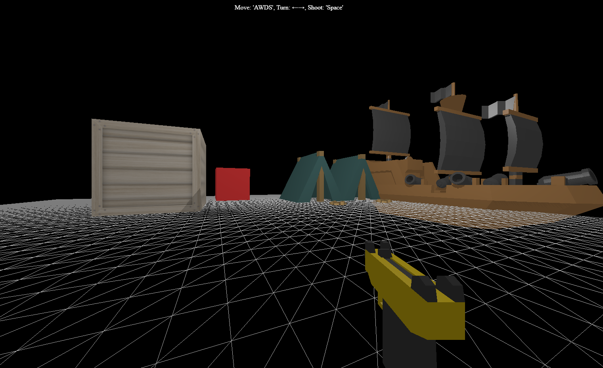

# Three.js practice

## Result preview



## [Video tutorial by xSaucecode](https://www.youtube.com/playlist?list=PLCTVwBLCNozSGfxhCIiEH26tbJrQ2_Bw3)

## [Origin Repository](https://github.com/saucecode/threejs-demos)

## [Textures & More](https://opengameart.org/)

## [Textures & More](https://www.kenney.nl/assets)

## script

```json
{
  "scripts": {
    "dev": "vite", // start dev server, aliases: `vite dev`, `vite serve`
    "build": "vite build", // build for production
    "preview": "vite preview" // locally preview production build
  }
}
```
